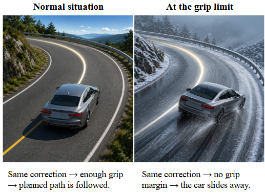
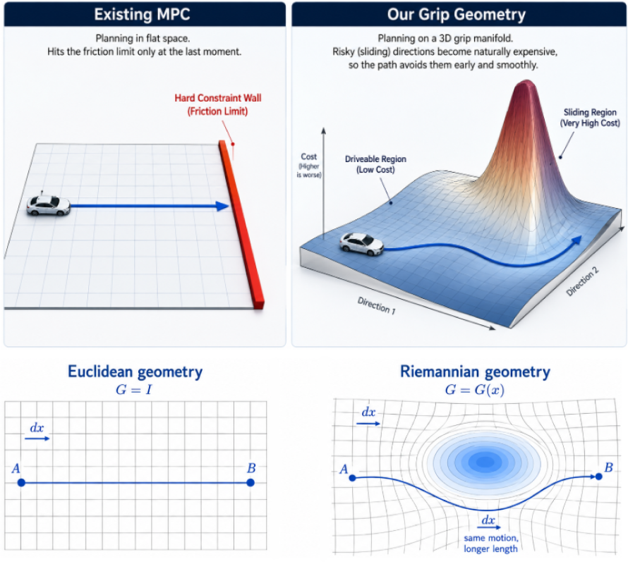
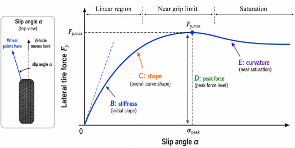

# Grip-Aware Riemannian MPC for Vehicle Planning
A research concept for making vehicle trajectory optimisation aware of the remaining tire grip by embedding tire physics directly into the geometry used by MPC

**The main idea** is to make a solver use geometry, which bases on physic of the grip, to naturally avoid dangerous zones before they even happen, instead of checking strict boundaries.

> **Status:** research formulation in progress.  
> The final grip-aware metric has not yet been fixed or experimentally validated.

---

## Why this project?

1. **Physical level (Tire grip become nonlinear):** At the grip limit, the classical linear control model completely breaks down. The car stops following the steering commands.
2. **Mathematical Level (Loss of Convexity):** To calculate a path within 10 ms, standard MPC either gets trapped in a dangerous local minimum or completely freezes due to numerical failure.

  
  This is especially important/dangerous during:
  <ul> 
    <li> high-speed cornering </li>
    <li> hard braking </li>
    <li> combined braking and steering </li>
    <li> low-grip road conditions </li>
    <li> near-limit vehicle motion </li>
  </ul>

As a result, a trajectory may therefore look short or attractive geometrically, while still demanding more tire force than the vehicle can safely provide, which can lead to collision.

---

## From flat space to grip-aware geometry

  
  
  **Euclidean MPC**
  
  Standard MPC usually measures trajectory changes in a fixed Euclidean space:
       
  $$
  ds^2 = dx^T dx
  $$
          
  The geometry treats every direction the same. Grip only appears later as a constraint or penalty, and can't be counted beforehand.
  
  **Riemannian MPC**
  
  Riemannian geometry allows the metric to change with the vehicle state:
          
  $$
  ds^2 = dx^T G(x,u)\,dx
  $$
          
  The geometry itself changes with grip. Near the limit, risky directions become longer and more expensive before the constraint is reached.

  <i>Instead of only checking the grip limit, we make the optimiser “feel” it through the geometry in advance.</i>

---

## Tire physics

We need a tire model that tells us how tire force changes as the tire approaches saturation. The common tire model Pacejka Magic Formula sufficiently describes it, because it captures the main nonlinear effect we care about: lateral tire force grows with slip angle, reaches a peak, and then saturates.

  
  
  **F(α) = D sin[C arctan(Bα - E(Bα - arctan(Bα)))]**
  
  where:
  <ul>
    <li>α - slip angle </li>
    <li> B - stiffness factor </li>
    <li> C - shape factor </li>
    <li> D - peak force level </li>
    <li> E - curvature factor </li>
  </ul>

For the first formulation, this is enough to test the geometric idea: the metric only needs a physically meaningful signal that changes as the tire approaches its force limit.

<em>The current formulation simplifies several effects (tire temperature, tire wear, transient tire dynamics, detailed load transfer, road surface variation along the contact patch, full combined-slip behaviour etc.) </em>

_The simplification is intentional: it lets us isolate and test the Riemannian formulation first. More detailed tire physics can later replace the simplified model without changing the basic geometric framework._

---

## Combined tire usage

Pacejka gives us the nonlinear tire-force behaviour, but the controller also needs a single measure of **how much of the available tire-force capacity is currently being used**.
Braking and cornering use the same tire-road contact, so longitudinal and lateral forces compete for the same available grip. We therefore combine them into a single utilisation value for tire i:

$$
\eta_i =
\sqrt{
\left(\frac{F_{x,i}}{\mu F_{z,i}}\right)^2 +
\left(\frac{F_{y,i}}{\mu F_{z,i}}\right)^2
}
$$

where:
- Fx - longitudinal force
- Fy - lateral force
- Fz - vertical tire load
- μ - tire-road friction coefficient

This gives the metric a continuous signal of how close the tire is to its assumed force limit. 
Interpretation:
- $\eta_i \ll 1$ → large remaining grip
- $\eta_i \rightarrow 1$ → tire close to saturation

With the same friction coefficient μ, the utilisation still changes with the current driving condition:
- straight and steady driving → low η
- hard braking → higher η
- hard cornering → higher η
- braking and cornering together → even higher η
This gives the metric a continuous signal of how close the tire is to its assumed force limit.

_We use the friction circle as a first approximation of combined tire demand. It does not give an exact remaining-grip value, but it changes with the current longitudinal and lateral forces. This is enough to test the geometric formulation. A higher-fidelity combined-slip model will be needed later for precise real-world grip estimation._

---

## Grip-aware metric concept

The exact final form of the metric is still under development.

Conceptually, the metric should satisfy two ideas:
**1. Direction**
  The metric should identify which directions in state space increase tire utilisation.
  For example, a change in lateral velocity, yaw rate, steering demand, or longitudinal acceleration may move the vehicle closer to saturation.

A gradient such as

\[
\nabla_x \eta_i
\]

can describe the direction in state space that increases utilisation for tire \(i\).

**2. Magnitude**
The deformation should become stronger as the remaining grip becomes smaller.
So the metric can be thought of schematically as

\[
G_{\text{grip}}
=
G_0
+
\text{grip-dependent deformation}
\]

where:

- \(G_0\) is the base metric
- the deformation acts mainly along directions that increase tire demand
- the deformation grows as tire utilisation approaches the grip limit

The exact weighting law is intentionally left open at this stage and must be derived and validated mathematically.

  

---

## How this changes trajectory optimisation

A trajectory can be assigned a Riemannian cost of the form

\[
J
=
\int_0^T
\dot{x}^{T}
G(x,u)
\dot{x}
\,dt
\]

- If the vehicle remains in a high-grip region, the metric stays close to the base geometry.
- If a candidate trajectory enters a near-saturation state, the metric increases the cost of motion in directions that consume the remaining grip.

As a result, a risky trajectory becomes geometrically longer.

The optimiser can then prefer alternatives such as:
- braking earlier
- reducing corner entry speed
- choosing a smoother steering profile
- shifting toward a trajectory with more available grip

The goal is not to remove physical constraints, but to make the optimiser aware of the approaching limit before the constraint becomes active.

---

## Riemannian MPC concept

The proposed MPC formulation would combine:

1. a nonlinear vehicle model
2. nonlinear tire-force modelling
3. tire utilisation
4. a state-dependent Riemannian metric
5. trajectory optimisation using the resulting geometric cost

The resulting trajectory should approximately follow a low-cost path through the grip-aware geometry rather than only minimising Euclidean tracking error.

  

---

## Neural geodesic warm-start

Riemannian trajectory optimisation may be more expensive than conventional MPC.

A possible AI extension is therefore a lightweight neural warm-start.

### Offline

1. Solve the Riemannian MPC problem for many vehicle states and road conditions.
2. Store state → optimised trajectory pairs.
3. Train a neural network to predict a good initial trajectory.

### Online

1. Observe the current vehicle state.
2. Predict a geometry-aware initial trajectory.
3. Use this trajectory as the starting point for the MPC solver.
4. Let MPC perform the final constrained optimisation.

The neural network would not replace the controller.

Its purpose would be to reduce solver iterations while keeping the final trajectory inside the physics-based optimisation framework.

---

## What still needs to be proved

This project is currently a research formulation, so several mathematical questions are still open.

### Metric validity

The final metric must be shown to be:

- symmetric
- positive definite
- sufficiently smooth
- numerically well-conditioned
- physically meaningful near the grip limit

### Geodesic behaviour

The geometry should be studied to determine:

- whether valid geodesics exist
- whether they are unique in the operating region
- how they behave near strong grip deformation
- whether the geodesic optimisation converges reliably

### MPC stability

The final controller should also require a stability analysis.

A planned direction is to study a Lyapunov function \(V(x)\) and establish conditions such as

\[
V(x_{k+1}) - V(x_k) \leq 0
\]

along the closed-loop trajectory.

The goal would be to show that the grip-aware cost changes the optimisation geometry without destroying closed-loop stability.

### Real-time feasibility

The project must also test whether the additional geometric computations are practical for real-time control.

This includes:

- metric evaluation cost
- geodesic computation
- MPC convergence time
- benefit of neural warm-start
- sensitivity to friction estimation errors

---

## Current status

Completed so far:
- physical problem formulation
- Pacejka-based grip analysis
- combined tire-utilisation formulation
- Riemannian geometry interpretation
- preliminary grip-aware metric concept
- neural geodesic warm-start concept

Still in progress:
- final analytical metric derivation
- implementation in the vehicle model
- proof of metric properties
- geodesic convergence analysis
- Lyapunov stability analysis
- MPC integration
- real-data validation
