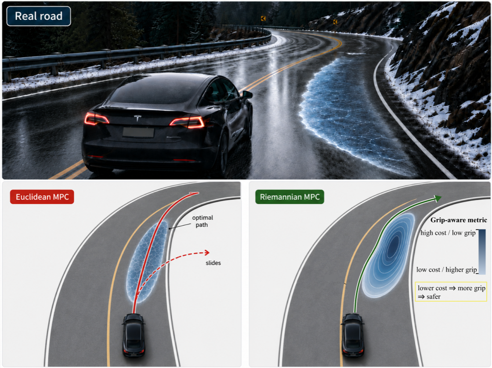
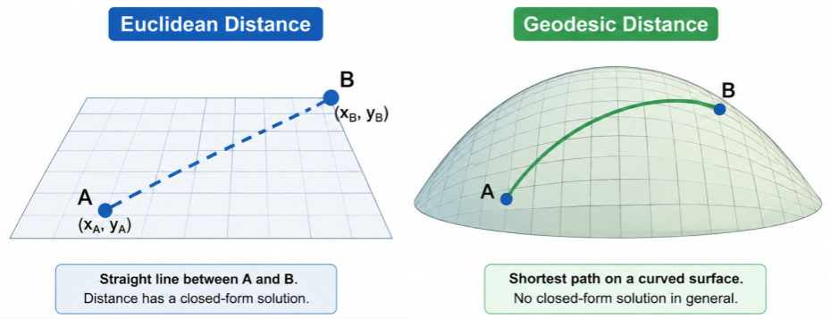
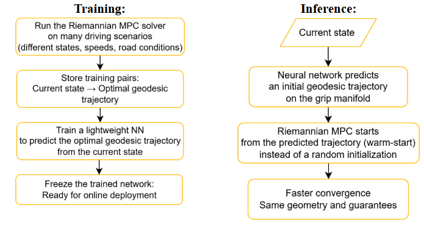

# Grip-Aware Riemannian MPC for Vehicle Planning
A research concept for making vehicle trajectory optimisation aware of the remaining tire grip by embedding tire physics directly into the geometry used by MPC

**The main idea** is to make a solver use geometry, which bases on physic of the grip, to naturally avoid dangerous zones before they even happen, instead of checking strict boundaries.

> **Status:** research formulation in progress.  
> The final grip-aware metric has not yet been fixed or experimentally validated.

---

## Why this project?

1. **Physical level (Tire grip become nonlinear):** At the grip limit, the classical linear control model completely breaks down. The car stops following the steering commands.
2. **Mathematical Level (Loss of Convexity):** To calculate a path within 10 ms, standard MPC either gets trapped in a dangerous local minimum or completely freezes due to numerical failure.

  
  This is especially important/dangerous during:
  <ul> 
    <li> high-speed cornering </li>
    <li> hard braking </li>
    <li> combined braking and steering </li>
    <li> low-grip road conditions </li>
    <li> near-limit vehicle motion </li>
  </ul>

As a result, a trajectory may therefore look short or attractive geometrically, while still demanding more tire force than the vehicle can safely provide, which can lead to collision.

---

## From flat space to grip-aware geometry

  
  
  <b>Euclidean MPC</b>
  
  Standard MPC usually measures trajectory changes in a fixed Euclidean space:
       
  $$
  ds^2 = dx^T dx
  $$
          
  The geometry treats every direction the same. Grip only appears later as a constraint or penalty, and can't be counted beforehand.
  
  **Riemannian MPC**
  
  Riemannian geometry allows the metric to change with the vehicle state:
          
  $$
  ds^2 = dx^T G(x,u) dx
  $$
          
  The geometry itself changes with grip. Near the limit, risky directions become longer and more expensive before the constraint is reached.

  <i>Instead of only checking the grip limit, we make the optimiser “feel” it through the geometry in advance.</i>

---

## Tire physics

We need a tire model that tells us how tire force changes as the tire approaches saturation. The common tire model Pacejka Magic Formula sufficiently describes it, because it captures the main nonlinear effect we care about: lateral tire force grows with slip angle, reaches a peak, and then saturates.

  
  
  **F(α) = D sin[C arctan(Bα - E(Bα - arctan(Bα)))]**
  
  where:
  <ul>
    <li>α - slip angle </li>
    <li> B - stiffness factor </li>
    <li> C - shape factor </li>
    <li> D - peak force level </li>
    <li> E - curvature factor </li>
  </ul>

For the first formulation, this is enough to test the geometric idea: the metric only needs a physically meaningful signal that changes as the tire approaches its force limit.

<em>The current formulation simplifies several effects (tire temperature, tire wear, transient tire dynamics, detailed load transfer, road surface variation along the contact patch, full combined-slip behaviour etc.) </em>

_The simplification is intentional: it lets us isolate and test the Riemannian formulation first. More detailed tire physics can later replace the simplified model without changing the basic geometric framework._

---

## Combined tire usage

Pacejka gives us the nonlinear tire-force behaviour, but the controller also needs a single measure of **how much of the available tire-force capacity is currently being used**.
Braking and cornering use the same tire-road contact, so longitudinal and lateral forces compete for the same available grip. We therefore combine them into a single utilisation value for tire i:

$$
\eta_i =
\sqrt{
\left(\frac{F_{x,i}}{\mu F_{z,i}}\right)^2 +
\left(\frac{F_{y,i}}{\mu F_{z,i}}\right)^2
}
$$

where:
- Fx - longitudinal force
- Fy - lateral force
- Fz - vertical tire load
- μ - tire-road friction coefficient

This gives the metric a continuous signal of how close the tire is to its assumed force limit. 
Interpretation:
- $\eta_i \ll 1$ → large remaining grip
- $\eta_i \rightarrow 1$ → tire close to saturation

With the same friction coefficient μ, the utilisation still changes with the current driving condition:
- straight and steady driving → low η
- hard braking → higher η
- hard cornering → higher η
- braking and cornering together → even higher η
This gives the metric a continuous signal of how close the tire is to its assumed force limit.

_We use the friction circle as a first approximation of combined tire demand. It does not give an exact remaining-grip value, but it changes with the current longitudinal and lateral forces. This is enough to test the geometric formulation. A higher-fidelity combined-slip model will be needed later for precise real-world grip estimation._

---

## Building the grip-aware metric

We now combine the two previous ideas:
- tire utilisation tells us how close each tire is to saturation
- Riemannian geometry lets the cost of motion change with the vehicle state

The metric should use this information to make state changes that consume the remaining grip more expensive.

In simple terms: **the closer the tire is to its limit, the more strongly the geometry should penalise motion that pushes it further toward saturation.**

---

## Using the metric inside MPC

Once the metric is defined, it becomes part of the trajectory cost:

$$
J =
\int_0^T
\dot{x}^T
G_{\text{grip}}(x)
\dot{x}
\,dt
$$

  
  <ul>
    <li> A trajectory that stays far from saturation remains relatively cheap. </li>
    <li> A trajectory that moves through near-limit states becomes geometrically longer and more expensive. </li>
  </ul>
  
  The optimiser can therefore prefer actions such as:
  <ul>
    <li> braking earlier </li>
    <li> reducing corner-entry speed </li>
    <li> using a smoother steering input </li>
    <li> choosing a path with more available grip </li>
  </ul>

The main idea is simple:
> **the controller does not only check the grip limit — the trajectory cost already changes as the vehicle approaches it.**

---

## Changing the geometry creates a new optimisation problem

  
  In Euclidean space, straight-line distances are cheap to compute. In a state-dependent metric, the low-cost trajectory follows a **geodesic** - the shortest path according to the grip-aware geometry. 
  Finding this path repeatedly inside MPC can be computationally expensive, especially when the geometry changes with the vehicle state.  
  
  **This creates a practical challenge**: the geometry may improve the trajectory cost, but the solver still has to find the geodesic fast enough for real-time control.

---

## Neural geodesic warm-start

To reduce this computational cost, the planned AI extension is a lightweight neural warm-start.

  
  
  **Offline**
  <ol>
    <li> Run the Riemannian MPC solver on many vehicle states and grip conditions.</li>
    <li> Store the resulting optimised trajectories. </li>
    <li> Train a neural network to predict a good initial trajectory. </li>
  </ol>
  
  **Online**
  <ol>
    <li> Observe the current vehicle state. </li>
    <li> Predict a geometry-aware initial trajectory. </li>
    <li> Use it as the starting point for Riemannian MPC. </li>
    <li> Let MPC perform the final physics-based optimisation. </li>
  </ol>

The neural network does not replace MPC. Its role is only to give the optimiser a better starting point so that fewer solver iterations may be needed.

---

## What comes next

The next steps are to:
- derive and verify the final grip-aware metric
- integrate it into MPC and study geodesic convergence
- check closed-loop stability
- test whether neural warm-start improves real-time performance
- validate the method on low-grip driving data

_No experimental results are claimed yet._
- MPC integration
- real-data validation
